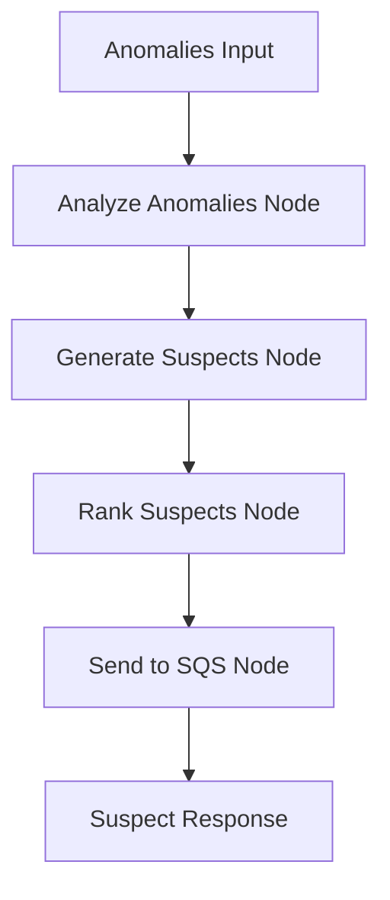

# Suspect Generation Agent

AI-powered root cause suspect generation service using FastAPI and LangGraph.

## 🎯 Purpose

This service receives anomalies from the Anomaly Detection API and generates intelligent root cause suspects using AI and rule-based methods. It analyzes anomaly patterns and creates actionable suspects with confidence scores, suggested actions, and detailed evidence.

## 🏗️ Architecture

- **FastAPI**: Web framework for REST API endpoints
- **LangGraph**: Workflow orchestration for suspect generation pipeline
- **AWS SQS**: Queue service for sending suspects to notification systems
- **Rule-based Engine**: Pattern matching for different anomaly types
- **Docker**: Containerized deployment

## 🔄 Workflow



## 📡 API Endpoints

### Health Check
```bash
GET /health
```

### Generate Suspects
```bash
POST /generate-suspects
Content-Type: application/json

{
  "incident_id": "bugraid-INC-6825",
  "anomalies": [
    {
      "log_index": 42,
      "timestamp": "2025-09-19T07:49:29Z",
      "level": "ERROR",
      "message": "Database connection timeout after 30s",
      "service": "user-service",
      "confidence": 0.85,
      "anomaly_type": "performance"
    }
  ],
  "context": {
    "environment": "production",
    "affected_users": 150
  }
}
```

**Response:**
```json
{
  "incident_id": "bugraid-INC-6825",
  "suspects_generated": 3,
  "suspects": [
    {
      "id": "suspect_bugraid-INC-6825_0_20250919074930",
      "incident_id": "bugraid-INC-6825",
      "type": "database",
      "title": "Database performance issue affecting user-service",
      "description": "Detected database issue with confidence 0.85. Evidence: Database connection timeout after 30s",
      "confidence": 0.85,
      "severity": "critical",
      "evidence": [
        "Database connection timeout after 30s",
        "Anomaly type: performance"
      ],
      "suggested_actions": [
        "Check database performance metrics",
        "Review slow query logs",
        "Verify database connection pools"
      ],
      "created_at": "2025-09-19T07:49:30Z",
      "metadata": {
        "anomaly_index": 42,
        "anomaly_timestamp": "2025-09-19T07:49:29Z",
        "service": "user-service",
        "features": {
          "message_length": 45,
          "error_keywords": 2,
          "level_severity": 4,
          "response_time": 30000
        }
      }
    }
  ],
  "processing_time_ms": 245,
  "timestamp": "2025-09-19T07:49:30Z"
}
```

## 🔧 Configuration

### Environment Variables

| Variable | Description | Default |
|----------|-------------|---------|
| `AWS_REGION` | AWS region for SQS | `ap-southeast-1` |
| `SQS_QUEUE_URL` | SQS queue URL for suspects | Required |
| `ENVIRONMENT` | Deployment environment | `development` |

## 🧠 Suspect Types

### Infrastructure
- Resource utilization issues
- Auto-scaling problems
- Hardware failures

### Application
- Code errors and exceptions
- Performance bottlenecks
- Memory leaks

### Database
- Query performance issues
- Connection pool problems
- Lock contention

### Network
- Connectivity issues
- DNS resolution problems
- Firewall/security group issues

### Configuration
- Environment variable issues
- Configuration file problems
- Feature flag conflicts

### Deployment
- Recent deployment issues
- Version compatibility problems
- Rollback requirements

## 🎯 Suspect Generation Logic

### Rule-based Patterns
```python
patterns = {
    "performance": [
        {"keywords": ["timeout", "slow", "latency"], "type": "INFRASTRUCTURE", "confidence": 0.8},
        {"keywords": ["memory", "cpu", "resource"], "type": "INFRASTRUCTURE", "confidence": 0.9},
        {"keywords": ["database", "query", "connection"], "type": "DATABASE", "confidence": 0.85}
    ],
    "error": [
        {"keywords": ["exception", "error", "failed"], "type": "APPLICATION", "confidence": 0.7},
        {"keywords": ["network", "connection", "unreachable"], "type": "NETWORK", "confidence": 0.8}
    ]
}
```

### Confidence Scoring
- **Pattern Match**: Base confidence from rule patterns
- **Anomaly Confidence**: Multiplied by anomaly detection confidence
- **Evidence Strength**: Additional boost for strong evidence
- **Historical Data**: Learning from previous incidents (future enhancement)

### Severity Mapping
- **Critical**: ERROR/CRITICAL logs or confidence > 0.9
- **High**: WARNING logs or confidence > 0.7
- **Medium**: Confidence > 0.5
- **Low**: All other suspects

## 🚀 Deployment

### Docker Build
```bash
docker build -t suspect-generation-service .
```

### Local Run
```bash
docker run -p 8000:8000 \
  -e AWS_REGION=ap-southeast-1 \
  -e SQS_QUEUE_URL=your-sqs-url \
  suspect-generation-service
```

### ECS Deployment
```bash
# Register task definition
aws ecs register-task-definition --cli-input-json file://suspect-generation-task-definition.json

# Create service
aws ecs create-service \
  --cluster your-cluster \
  --service-name suspect-generation-service \
  --task-definition suspect-generation-service \
  --desired-count 1
```

## 📊 Monitoring

### Health Check
The service provides a health endpoint that checks:
- Service status
- SQS connectivity
- Current timestamp

### Logging
- Structured logging with timestamps
- Request/response logging
- Suspect generation metrics

### Metrics
- Suspects generated per incident
- Processing time per request
- Confidence score distributions
- Suspect type distributions

## 🔍 Example Usage

```python
import httpx

async def generate_suspects(incident_id: str, anomalies: list):
    async with httpx.AsyncClient() as client:
        response = await client.post(
            "http://suspect-service:8000/generate-suspects",
            json={
                "incident_id": incident_id,
                "anomalies": anomalies,
                "context": {"environment": "production"}
            }
        )
        return response.json()

# Usage
suspects = await generate_suspects("bugraid-INC-6825", anomaly_list)
print(f"Generated {suspects['suspects_generated']} suspects")
```

## 🔗 Integration

### Input Sources
- **Anomaly Detection Agent**: Primary source of anomalies
- **Direct API Calls**: Manual suspect generation
- **Scheduled Jobs**: Batch processing of incidents

### Output Destinations
- **SQS Queue**: Suspects sent for Slack notifications
- **API Response**: Immediate response to callers
- **Logging**: Audit trail of all suspects

## 🛠️ Development

### Requirements
- Python 3.11+
- AWS SQS access
- Docker (for containerization)

### Local Development
```bash
# Install dependencies
pip install -r requirements.txt

# Run locally
python suspect_generation_service.py

# Test endpoint
curl -X POST http://localhost:8000/generate-suspects \
  -H "Content-Type: application/json" \
  -d '{"incident_id": "test-incident", "anomalies": []}'
```

### Testing
```bash
# Health check
curl http://localhost:8000/health

# Suspect generation test
curl -X POST http://localhost:8000/generate-suspects \
  -H "Content-Type: application/json" \
  -d '{
    "incident_id": "bugraid-INC-6825",
    "anomalies": [
      {
        "anomaly_type": "performance",
        "message": "Database timeout",
        "confidence": 0.8,
        "service": "user-service"
      }
    ]
  }'
```

## 📈 Performance

- **CPU**: 512 units (0.5 vCPU)
- **Memory**: 1024 MB (1 GB)
- **Processing**: ~50-100 suspects per second
- **Latency**: <500ms for typical suspect generation

## 🔐 Security

- Environment-based configuration
- No hardcoded credentials
- Secure SQS connections
- Container isolation
- IAM role-based access

## 🚨 Error Handling

- Graceful degradation when SQS is unavailable
- Fallback to generic suspects when patterns don't match
- Comprehensive error logging
- Retry logic for transient failures

## 📝 License

MIT License - See LICENSE file for details.
